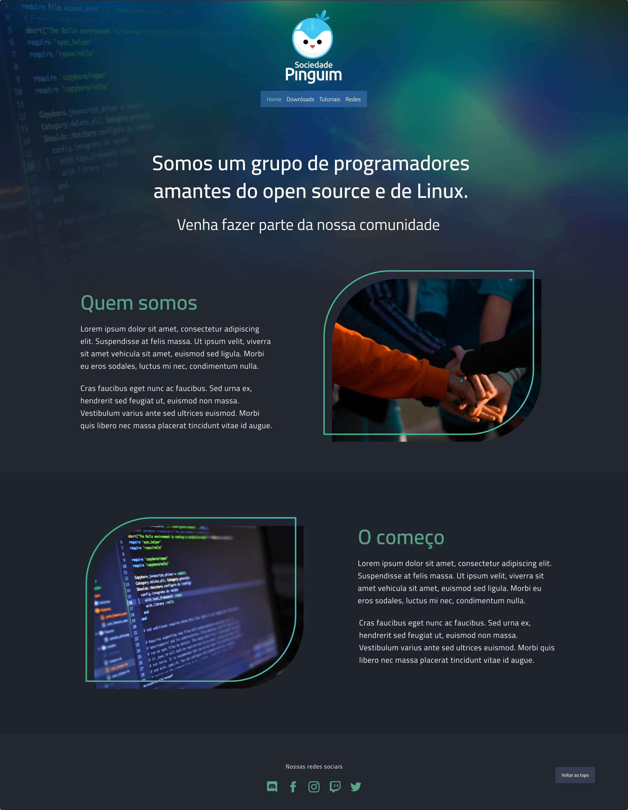
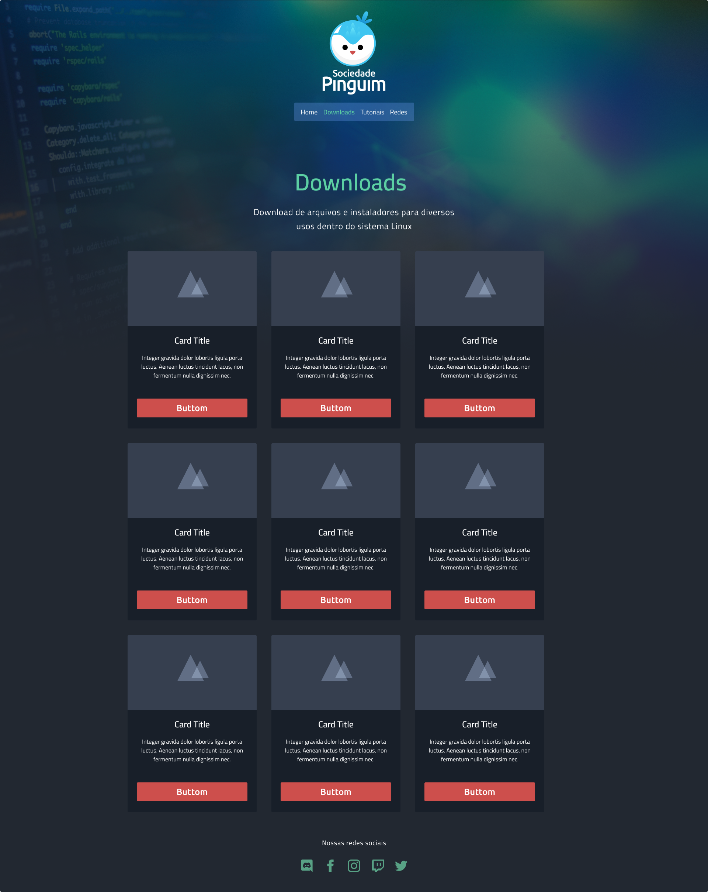
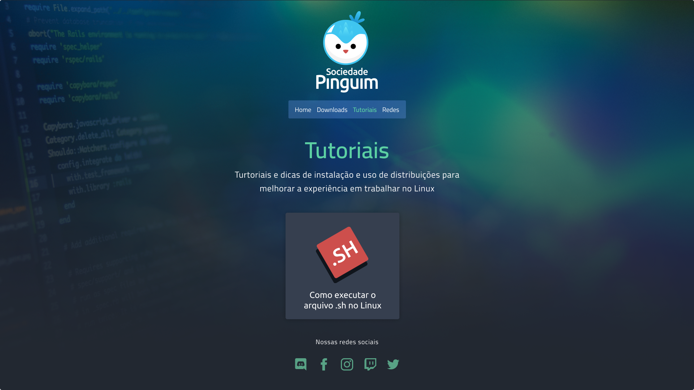
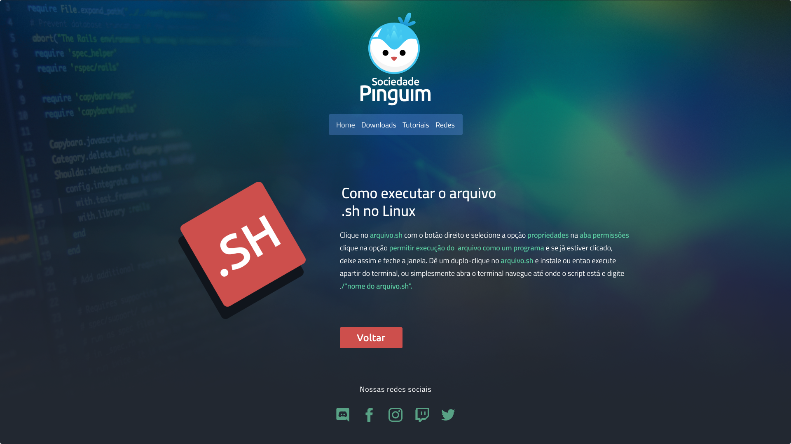

# Sociedade-Pinguim / Penguin Society
Site oficial da comunidade Pinguim de desenvolvedores de amantes de Linux

### Objetivo

Criação da págia para Sociedade Pinguim, um grupo de estudantes e desenvolvedores de software que promovem discussões e temas relacionados ao universo linux, programação e jogos.

O objetivo do projeto é o redesign do portal do projeto.

Primeiramente iniciei o design no Figma, em seguida desenvolvi todas as telas com html CSS puro usando Sass como pré processado, implementando somente soluções javascript de outras fontes para animações na home.

Esse projeto é totalmente feito usando a metodologia Mobiel first

### Detalhes do projeto de design 

Detalhes do projeto de desing podem ser conferidos no meu portifólio [www.felipefelixdesigner.com/projetopinguim](#)

### Projeto online

Fiz o deploy desse projeto no **Netfly** para que fique online para testes.

[www.projetosociedadepinguim.com](https://projetosociedadepinguim.netlify.app/)

## For English Readers

### Objective

The main goal is the redesign of the **Sociedade Pinguim project webpage**, a group of studants and developers whom love linux any kind of subject about opensource software, programming and games.Firts I started the design using Figma, them codding the HTML and CSS, only using some external javascript solutions for the home text animation.

This is a total mobile first aproach.

### Design process

To see all the process and design details acess my portifolio at [www.felipefelixdesigner.com/projetopinguim](#)

### Online project

The page is online at **Netfly** and can be accessed at [www.projetosociedadepinguim.netfly.app](https://projetosociedadepinguim.netlify.app/)

### Imagens do projeto / Project images

Home

Download Page

Tutorial page

Tutorial Post

